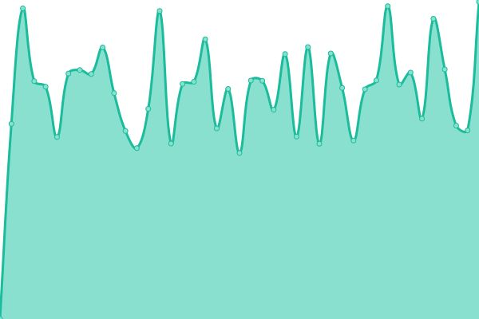

# [📈 Live Status](https://tanshiqi.github.io/uptime): <!--live status--> **🟩 All systems operational**

This repository contains the open-source uptime monitor and status page for [atan](http://atan.cn), powered by [Upptime](https://github.com/upptime/upptime).

With [Upptime](https://upptime.js.org), you can get your own unlimited and free uptime monitor and status page, powered entirely by a GitHub repository. We use [Issues](https://github.com/tanshiqi/uptime/issues) as incident reports, [Actions](https://github.com/tanshiqi/uptime/actions) as uptime monitors, and [Pages](https://tanshiqi.github.io/uptime) for the status page.

<!--start: status pages-->
<!-- This summary is generated by Upptime (https://github.com/upptime/upptime) -->
<!-- Do not edit this manually, your changes will be overwritten -->
<!-- prettier-ignore -->
| URL | Status | History | Response Time | Uptime |
| --- | ------ | ------- | ------------- | ------ |
|  [Tjad 官网](http://www.tjad.cn) | 🟩 Up | [tjad.yml](https://github.com/tanshiqi/uptime/commits/HEAD/history/tjad.yml) | 

 1264ms
     
 | 

<a href="https://tanshiqi.github.io/uptime/history/tjad">100.00%</a>
    

|  [Career 人才门户](http://careers.tjad.cn) | 🟩 Up | [career.yml](https://github.com/tanshiqi/uptime/commits/HEAD/history/career.yml) | 

 1062ms
     
 | 

<a href="https://tanshiqi.github.io/uptime/history/career">100.00%</a>
    

|  [Gallery 图库](http://da.tjad.cn) | 🟩 Up | [gallery.yml](https://github.com/tanshiqi/uptime/commits/HEAD/history/gallery.yml) | 

 1385ms
     
 | 

<a href="https://tanshiqi.github.io/uptime/history/gallery">100.00%</a>
    

|  [Video 视频库](http://vd.tjad.cn) | 🟩 Up | [video.yml](https://github.com/tanshiqi/uptime/commits/HEAD/history/video.yml) | 

 2054ms
     
 | 

<a href="https://tanshiqi.github.io/uptime/history/video">100.00%</a>
    

|  [Award 评选管理系统](http://award.tjad.cn) | 🟩 Up | [award.yml](https://github.com/tanshiqi/uptime/commits/HEAD/history/award.yml) | 

 1298ms
     
 | 

<a href="https://tanshiqi.github.io/uptime/history/award">100.00%</a>
    

<!--end: status pages-->

[**Visit our status website →**](https://tanshiqi.github.io/uptime)

## 📄 License

- Powered by: [Upptime](https://github.com/upptime/upptime)
- Code: [MIT](./LICENSE) © [atan](http://atan.cn)
- Data in the `./history` directory: [Open Database License](https://opendatacommons.org/licenses/odbl/1-0/)
